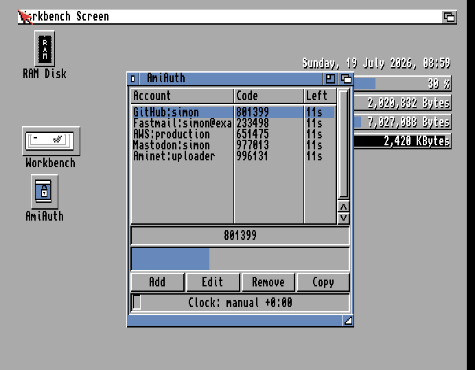

# GUI Guide

`AmiAuthGUI` is a ReAction application for AmigaOS 3.0+ showing all your
accounts with live codes. It is designed to run resident as a **commodity**
(hotkey popup, Exchange integration) — that side is covered in
[Commodity and Tooltypes](Commodity-and-Tooltypes.md); this page covers the window itself.

## The window

- **Account list** — one row per account, three columns: the account name
  (`issuer:label`), its current **code**, and the seconds **left** before the
  code changes. Each row refreshes when *that account's* code actually
  changes (every 30 seconds by default), not every second — the **left**
  column shows the seconds remaining as of that refresh rather than counting
  down continuously. This is deliberate: repainting the whole list every
  second turned out to briefly stall unrelated Workbench drag gestures
  system-wide, so it's throttled to only repaint when there's actually new
  code to show.
- **Large code display** — the selected account's code, big enough to read
  across the room. Shows `------` when nothing is selected or the vault is
  locked.
- **Countdown bar** — a fuelgauge draining through the current TOTP period for
  the selected account, updating every second — this is where to watch a
  live countdown; the account list's **left** column is a periodic snapshot,
  not a live counter.
- **Clock status line** — a coloured LED plus text such as `Clock: synced
  +0:15`. The GUI runs one SNTP sync automatically at startup (if a TCP/IP
  stack is up), so normally this simply lights green:
  - 🟢 **green** — offset verified by SNTP this session;
  - 🟠 **amber** — the startup sync wasn't possible; a stored or
    locale-derived offset is applied (`Clock: manual …`);
  - 🔴 **red** — `Clock: unverified`: nothing has corrected the clock, codes
    may be wrong. See [Time and Clock Sync](Time-and-Clock-Sync.md).

  Flanking the status line, **`D -10s`** / **`U +10s`** buttons nudge the
  offset by ten seconds each click — for dialling an offline clock in by eye
  against a known-good code, without leaving the window. Always available,
  independent of the vault's lock state (the clock affects every account's
  codes). The status text updates immediately with each click. Equivalent to
  the CLI's `AmiAuth NUDGE <seconds>` — see [Time and Clock Sync](Time-and-Clock-Sync.md) for a
  worked example.
- **Buttons** — **Add**, **Edit**, **Remove**, **Copy** (each also available
  from the menus).

## Copying a code

**Double-click an account** — or select it and press **Copy** — and the
current code is placed on the clipboard as standard text (IFF FTXT), ready to
paste into a browser or terminal. The button briefly shows "Copied".

**Auto-clear:** 30 seconds after the copy, AmiAuth clears the clipboard again —
but only if the clipboard still holds that code; anything you copied in the
meantime is left alone. This stops a stale 2FA code lingering in the clipboard.

## Adding accounts

Three ways, all under the **Account** menu:

- **Add from clipboard** — copy an `otpauth://` URI from anywhere, then select
  this item.
- **Add (type URI)…** — a requester to type or paste the URI directly.
- **Add from QR image…** — pick an image file of the enrolment QR code
  (PNG/JPEG/GIF/IFF/ILBM/BMP — anything a picture datatype can load); AmiAuth
  decodes the QR and imports the account. You can also **drag an image file
  onto the window** from Workbench. See [Managing Accounts](Managing-Accounts.md) for details and
  requirements.

## Editing and removing

- **Edit selected…** opens a requester for the **issuer**, **label**,
  **digits** (6–8) and **period** (1–86400 s). The label is required. The
  secret and account type are deliberately not editable — re-add the account
  if the secret changes.
- **Remove selected…** asks for confirmation, then deletes the account and
  saves the vault. There is no undo.

## Menus

| Menu | Item | Shortcut |
|------|------|----------|
| Project | Quit | Q |
| Account | Add from clipboard | *(none)* |
| | Add (type URI)… | A |
| | Add from QR image… | I |
| | Edit selected… | E |
| | Copy code | C |
| | Remove selected… | R |

(Standard Right-Amiga menu shortcuts — hold Right-Amiga and press the letter;
the item fires without opening the menu.)

## Keyboard shortcuts

Every action in the window is reachable without the mouse:

- **Buttons** — each button's underlined letter activates it directly, no
  modifier key: **_A_dd**, **_E_dit**, **_R_emove**, **_C_opy**, **_D_ -10s**,
  **_U_ +10s**. These match the equivalent Account-menu letters (A/E/R/C), so
  either route works.
- **Menu items** — Right-Amiga + the letter shown in [Menus](#menus) above,
  from anywhere in the window (no need to open the pull-down first).
- **Account list** — **Cursor Up/Down** move the selection one row at a time;
  the code display and countdown follow.

Left-Amiga is deliberately never used for AmiAuth's own shortcuts — it's
reserved system-wide (Workbench-to-front, screen-to-back, and the standard
requester gadgets), so using it here would fight the system rather than
follow it.

## First launch

If no vault exists yet, AmiAuthGUI offers to create one — the CLI is not
needed for setup:

1. A welcome requester shows where the vault will be created (normally
   `PROGDIR:AmiAuth.vault`, next to the program).
2. Choose a master passphrase and confirm it. For an encrypted vault the
   PBKDF2 work factor is then calibrated to about one second on your machine
   (a brief pause), exactly as the CLI's `INIT` does.
3. **Leaving the passphrase empty** creates an *always-unlocked* vault,
   behind an explicit warning — there is no at-rest protection in that mode
   (see [Security Model](Security-Model.md)); it is convertible later.
4. If the location isn't writable (a read-only or protected install), a file
   requester lets you choose somewhere else.

The created vault's absolute path is recorded in `ENVARC:AmiAuth/vault`, so
later launches — including from a WBStartup icon, where `PROGDIR:` differs —
find the same vault.

When started **hidden** (`CX_POPUP=no`, the WBStartup way), both this
first-run dialog and the encrypted-vault unlock prompt are deferred to the
first time the window is summoned — the boot stays silent. See
[Commodity and Tooltypes](Commodity-and-Tooltypes.md).

## Unlocking, locking and auto-lock

For an **encrypted vault**, the GUI prompts for the passphrase at startup in a
requester (input shown as `*` with a trailing `|` cursor so it's obvious you
can start typing right away; never stored in a gadget; Esc cancels). A wrong
passphrase re-prompts with "Wrong passphrase - try again:".

**Idle auto-lock:** after 2 minutes without input in an open window (default;
configurable — see [Settings Reference](Settings-Reference.md), `idlelock`, `0` disables), the GUI
locks the vault (keys and decrypted secrets are wiped from memory) and hides
the window, the same as the close gadget — the commodity stays resident. The
next time you summon it (hotkey, Exchange *Show*, or `AmiAuth SHOW`), it
re-prompts for the passphrase before the window reopens. A **hidden**
commodity window does not tick the idle timer — the point of the resident
commodity is keeping the vault unlocked; set `idlelock` to taste if you want
stricter behaviour.

While unlocked, remember what that means on AmigaOS: any running program can
read any memory. See [Security Model](Security-Model.md).

**Always-unlocked vaults** never prompt and never lock.

An encrypted vault may also trigger a **re-key offer** right after unlock if
this machine is much faster or slower than the vault's creator — "Strengthen"
is safe to accept; "Re-key lower" weakens security and asks twice. Choosing
"Never here" (or setting `ENVARC:AmiAuth/rekey` to `off`) silences the offers.
Background in [Security Model](Security-Model.md).

## Requirements and graceful degradation

The GUI needs AmigaOS 3.0+ with the ReAction/ClassAct classes (`window`,
`layout`, `listbrowser`, `fuelgauge`, `button`). Everything else is optional
and simply switches a feature off if missing:

| Missing library | Effect |
|-----------------|--------|
| `commodities.library` | No hotkey/Exchange; runs as a plain window (close = quit) |
| `iffparse.library` | Clipboard copy disabled |
| `gadtools.library` | No menus (buttons still work) |
| `string.gadget` class | "Add (type URI)" and "Edit" disabled |
| `datatypes.library` (v39) or `asl.library` | QR-image import disabled |
| `workbench.library` | No drag-and-drop QR import |
| `graphics.library` pens | LED falls back to monochrome |
